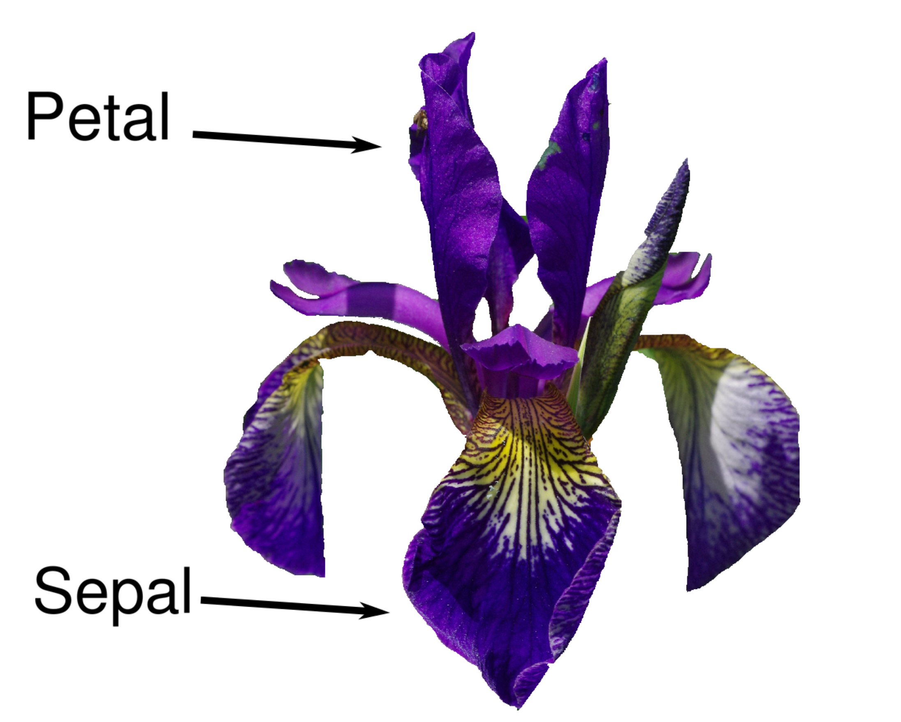

# **Classifying Iris Species**

Let’s assume that a hobby botanist is interested in distinguishing the species of some iris flowers that she has found. 
She has collected some measurements associated with each iris: the length and width of the petals and the length and width of the sepals, all measured in centimeters

She also has the measurements of some irises that have been previously identified by an expert botanist as belonging to the species setosa, versicolor, or virginica. For these measurements, she can be certain of which species each iris belongs to. Let’s assume that these are the only species our hobby botanist will encounter in the wild.

## Type of Machine Learning:

This is a supervised machine learning project, as the goal is to predict one of several options of species of iris.

This is also a classification problem,  as the possible outputs are the classes, and every iris in the dataset belongs to one of three classes. Thus, this is a three-classification problem.

## Data Used:

The data used for this project is the Iris dataset which is included in the scikit-learn in the dataset module.
I loaded it by calling the load_iris function.

## Steps:

### 1. Get to understand the data:
   - In this step I used the .keys() function to find the keys of the dataset. 
   - Then, I read the 'DESCR' which has the dataset characteristics, which shows that there are 150 instances total with 50 in each of the classes.
   - Also, that there are 3 classes: Setosa, Versicolour, and Virginica.
   - That the features are all in cm.
   - The features are: sepal length, sepal width, petal length, petal width.
   - It gives us the Min, Max, Mean, Standard Distribution and Class Correlation for the data.
   - This dataset has no missing attribute values
   - To continue understanding the data I check the target_names keys which is a a list of strings that holds the classes that we want to predict for each sample.
### 2. Then check more general facts about the data:
   - Revise the type of data, which is an n-dimensional numpy array.
   - Revise the shape of data which shows 150 samples with 4 features each.
   - Check the first 5 rows of data.
     - The first 5 rows of data show that from those 5 samples, all of them had the same petal width of 0.2cm.
     - The longest sepal length was of 5.1cm 
   - The type of target which is also a n-dimensional numpy array.
   - The shape of target which shows 150 results.
   - Then we print the target to see how is it that we should portray our results.
     - We see they are portrayed as o, 1 and 2 where 0 means Setosa, 1 means versicolor, and 2 means Virginica.

### 3. Divide the data on Training and Testing:
   - To make sure our model will _generalize_ well we use 75% of the data for training, and 25% for testing.
   - The train_test_split function in Python uses a pseudorandom number, in this case I am providing the pseurandom number using the random_state as that way I will be able to get a deterministic outcome.
   - We print the X_train shape to see if we split our training set correctly, we do the same for our testing set. 
   - by printing we see that our training set has 112 samples, while our testing set has 38 samples.

### 4. Inspect the dataset:
   - In the real world, all data has inconsistencies and unexpected measurements, it is a good idea to try to visualize them through a scatter plot.
   - A scatter plot of the data puts one feature along the x-axis and another along the y-axis, and draws a dot for each datapoint. Because computer screens have only two dimensions, we can only plot two or three features at a time.
   - One way around the scatter plot is to do a pair plot, which looks at all possible features, however, it does not show the interaction of all of the features at once.
   - In this case we have more than three features, therefore, I will use the scatter-matrix function from pandas. (The diagonal of this diagram is filled with histograms of each feature). Seaborn also allows us to do this pairplot, in Seaborn we can even put the histograms with different colors.

### 5. For this exercise, I am using a scatter plot as we have only four features.
   - The scatterplot.png image shows that the three classes are relatively well separated, thus, a machine learning model is able to learn to separate them.

## Reference:
A more simple version of this project was taken from the book "Introduction to Machine Learning with Python" by Andreas C. Muller and Sarah Guido. 
However, I made this project more complex to test my abilities and improve my understanding of the concepts in this book. This is the reason why I implemented my own KNN Algorithm from Scratch using Python.

